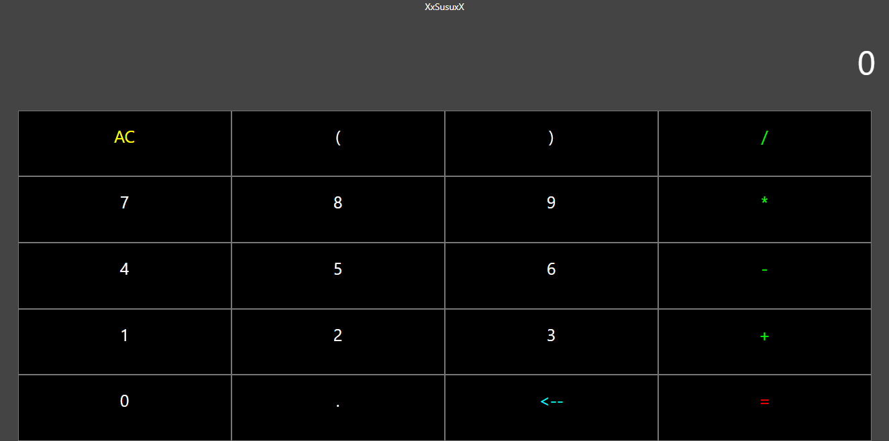
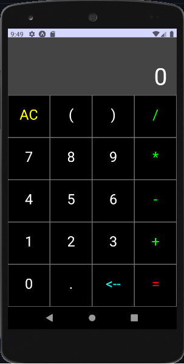
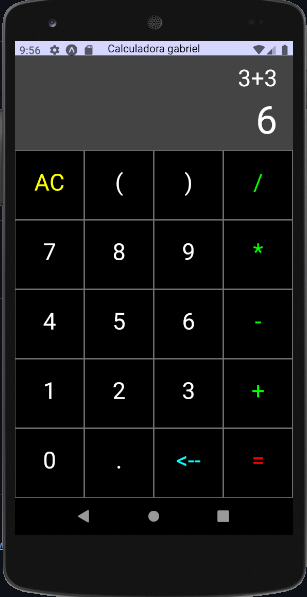

## Bem-vindo! 👋

Obrigado por visitar este projeto.

**Para fazer este projeto, precisei ter conhecimentos de React, Expo, JavaScript e npm**

## O Projeto

Meu projeto foi construir uma calculadora usando React, com adaptação para aplicativo mobile e para computadores na web.

Eu usei as ferramentas Android Studio para emular meu dispositivo móvel, npm para poder instalar minha dependências, React-native e React.js.

Como uma calculadora deve ser capazes de:

- Visualizar o diplay com os números digitados
- Visualizar o layout ideal para os botões, dependendo do tamanho da tela dos dispositivo
- Resultados dos calculos retornados corretamente

## Os arquivos

Para desenvolver a calculadora web e para app usei `React.js`.

A pasta `/Calculadora` armazena toda a parte do `React.js`, dentro da pasta você encontrará os arquivos, `App.js` , `buttons.js` ,`display.js`.

O arquivo principal `App.js` está importando o `display.js` e o `buttons.js`. No `display.js` será exibido os valores do `buttons.js`,

## O que eu aprendi

Neste projeto coloquei meu aprendizado com JavaScript em prática e um pouco de css e html, instalando as aplicações com npm, consegui ter noções boas do prompt de comando.

A calculadora em React requer a manipulação de diversos eventos, como o clique em botões, inserção de valores, etc. Aprendi a trabalhar com eventos em React que é essencial para criar aplicações que respondam às interações do usuário.

Componentização, Uma calculadora em React pode ser dividida em vários componentes, como botões, display, operações matemáticas, etc. Aprender a dividir a aplicação em componentes pode torná-la mais modular e fácil de manter.

# Resultado final

## Calculadora Web

## Aplicativo Mobile

## Autor

Nome - Gabriel Suenaga

Email - gabriel.hneus@gmail.com

Twitter - [@amo_pobres](https://twitter.com/amo_pobre)

Site - (**Portfólio em breve**)

## Tem algum feedback ?

Adoro receber feedback! Estou sempre buscando melhorar meus projetos. Portanto, se você tiver algo que gostaria de mencionar, envie um e-mail ou mensagem para mim.

Este projeto é totalmente aberto. Por favor, compartilhe com qualquer pessoa que achará útil.

**Divirta-se programando!** 🚀
